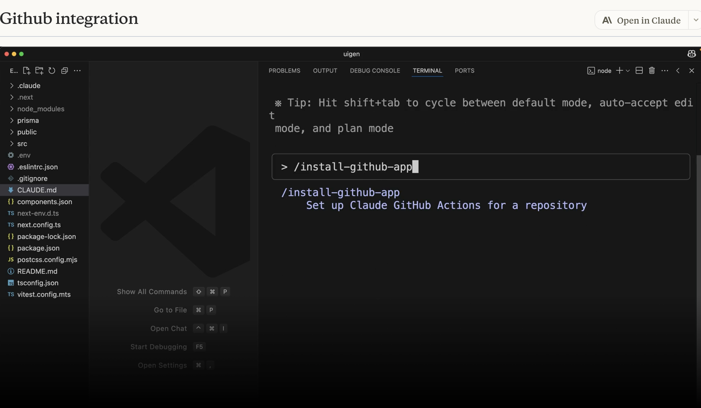

This one contains notes to the course: Claude code in action https://anthropic.skilljar.com/claude-code-in-action

- Claude Benefits


- Tools with Claude


- What is Claude.md for


- Claude.md config levels


- Claude thinking modes


- Claude Controlling context


- Claude where to put custom commands


- MCP servers with Claude Code


- MCP servers with Claude Code how to add playwright


- Claude how to config MCP permission


- Claude how to add github apps


- Claude git integration default Github actions


- Claude mcp config sample


- Claude hooks


- Claude how to config hooks


- Claude what to think, defining hooks


- Claude hooks tool calling config


- Claude hooks how to implement


- Claude hooks security best practice


- A sample of using Claude SDK


More notes:

Claude Code in Action
More aws claude config info: https://docs.anthropic.com/en/docs/claude-code/amazon-bedrock
Use @filename to mention file - eg. Have a db scheme, use # to add to Claude.md mention @dbschema and the structure, then later when asking claude, it will know how to use the file to answer question. Try that in fpz, tell it how to lookup the logic, then ask questions.
Shift+ tab plan mode
Thinking modes - Think, Think more, Think a lot, Think longer, Ultrathink
Plan mode for breath 
Think mode for depth
context:
Escape twice will bring previous conversations to see older prompts
/compact //this one keeps a summary of previous conversations but clears context
/clear //clear previous context, start something new
Custom commands using / slash 
.claude/commands/<customCommands>.md you can pass argument using $<variableName>
Claude with Playwright MCP:
claude mcp add playwright npx @playwright/mcp@latest
Permission is in .claude/settings.local.json
GitHub integration:
/install-github-app
For .github/workflow/claude.yml define mcp_config, allowed_tools has to be each listed, not shortcuts

Hooks:
Sample of not reading a .env file as pre claude hooks
Here are some key practices for writing more secure hooks:
1.    Validate and sanitize inputs - Never trust input data blindly
2.    Always quote shell variables - Use "$VAR" not $VAR
3.    Block path traversal - Check for … in file paths
4.    Use absolute paths - Specify full paths for scripts
5.    Skip sensitive files - Avoid env , git/ , keys, etc.

Useful hooks:
Add an extra arg to a method
tsc —noEmit to see places calling it is failing with typescript error
Add a post hook to ask claude to check and fix the calling of the method
There are more hooks beyond the PreToolUse and PostToolUse hooks discussed in this course. There are also:
* Notification - Runs when Claude Code sends a notification, which occurs when Claude needs permission to use a tool, or after Claude Code has been idle for 60 seconds
* Stop - Runs when Claude Code has finished responding
* SubagentStop - Runs when a subagent (these are displayed as a "Task" in the UI) has finished
* PreCompact - Runs before a compact operation occurs, either manual or automatic

Here's the confusing part:

1. The stdin input to your commands will change based upon the type of hook being executed (PreToolUse, PostToolUse, Notification, etc)
2. The tool_input contained in that will differ based upon the tool that was called (in the case of PreToolUse and PostToolUse hooks)
To handle this challenge, it is recommended to use a hook like this:
```
"PostToolUse": [ // Or "PreToolUse" or "Stop", etc
  {
    "matcher": "*",
    "hooks": [
      {
        "type": "command",
        "command": "jq . > post-log.json"
      }
    ]
  },
]`
```


Notice the provided command. It will write the input to this hook to the post-log.json file, which allows you to inspect exactly what would have been fed into your command! This makes it a lot easier for you to understand what data your command should inspect.

Claude code also has SDK which you can embed into your project to do things
