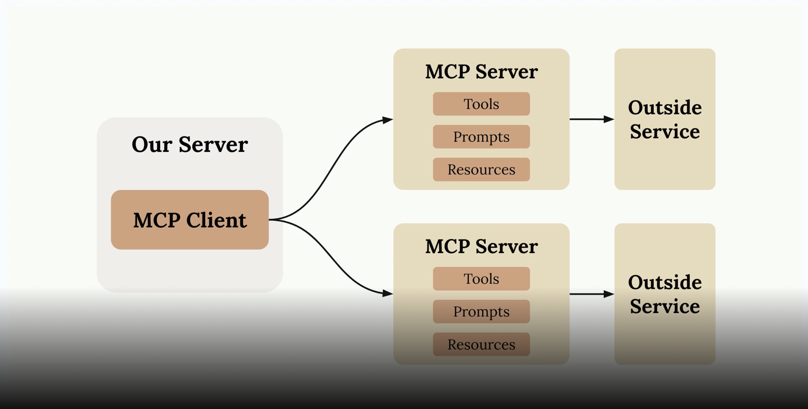
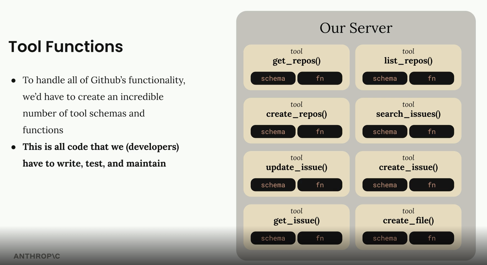
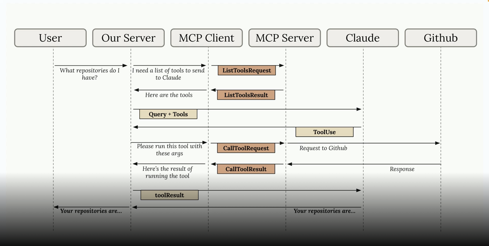
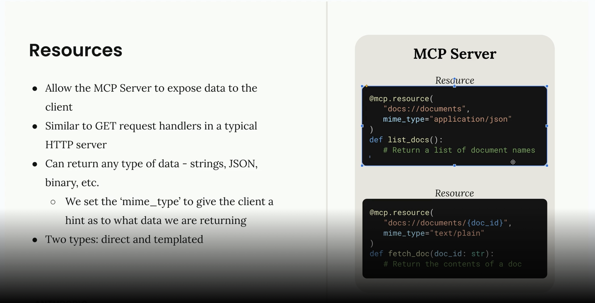
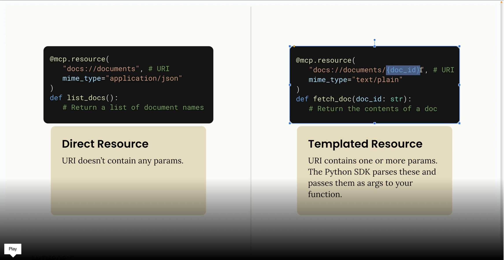
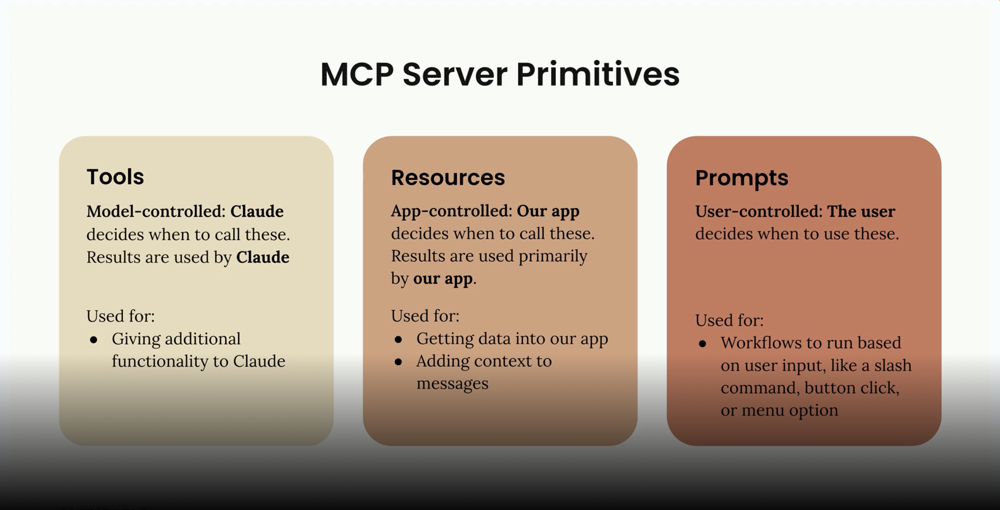

This one contains notes to https://anthropic.skilljar.com/introduction-to-model-context-protocol 
- MCP main client server chart

- MCP Git ToolList

- MCP To use Git tool sequence digram

- MCP to expose resources

- MCP direct vs templated resources

- MCP tools, resources, prompts who controls what

