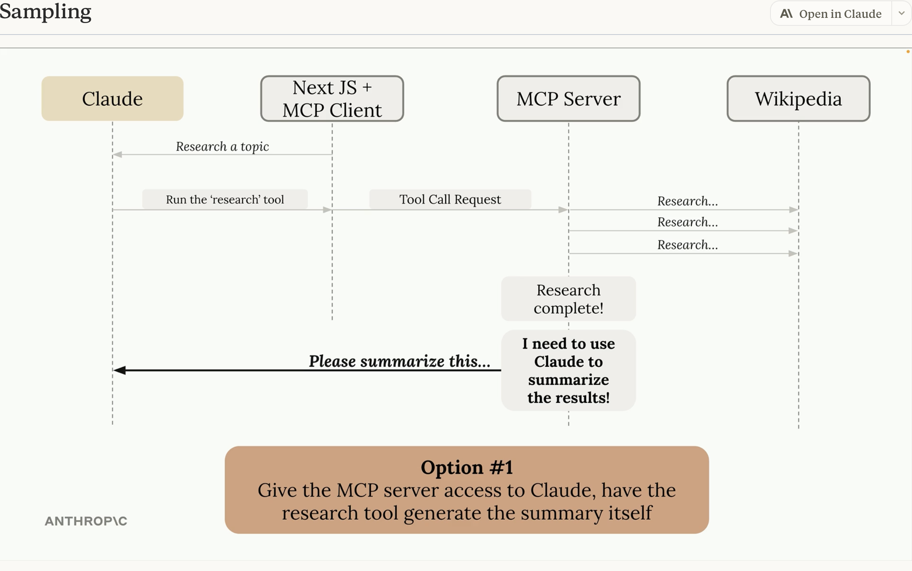

This one contains notes to the course: MCP Advanced Topics https://anthropic.skilljar.com/model-context-protocol-advanced-topics

- SamplingSequenceDiagramOption1.png

- SamplingSequenceDiagramOption2.png

- SamplingServerSide.png

- SamplingClientSide.png

- LogProgressNotifyWithContextObj.png

- LogProgressNotifyClientCallback.png

- MCPServerRoots.png

- RootsBenefits.png

- MCPJsonMessageTypes.png

MCP Json message types: https://github.com/modelcontextprotocol/modelcontextprotocol?tab=readme-ov-file

- MCPJSONMessages.png

- MCPJSONClientServerSequence.png

- MCPStdIoTransport.png

StdIO 
- both client and server on the same machine. client writes to standard in, server write to standard out
- both can init request

- MCPStreamableHTTP.png

- MCPStreamableHTTPGetPull.png

- MCPStreamableHTTPStatelessAndJsonResponse.png

### MORE:
- https://github.com/modelcontextprotocol/modelcontextprotocol/discussions
- https://modelcontextprotocol.io/docs/getting-started/intro
## Questions
### Sampling: With MCP sampling technique, it seems client and server couples too much, how will it scale if user has a request that needs multiple MCP server?

- When you say “MCP sampling couples client and server too much”, you’re probably noticing that in the sampling mode, the client must know the server’s schema and semantics in order to decide when and how to call it. That creates tight coupling if you want to scale to multiple MCP servers or compose them dynamically.

Here are some scaling considerations and strategies:

⸻

1. Multiplexing MCP Servers
	•	The MCP spec allows the client to connect to multiple servers at once, each exposing its own resources and tools.
	•	The client can merge those into a single “capability space” (e.g., multiple data providers for different domains).
	•	This still leaves the coordination burden on the client, since the servers don’t directly talk to each other.

⸻

2. Request Orchestration

If a user request requires more than one MCP server:
	•	Option A: Client-side orchestration. The model decides the sequence of calls: e.g. call MCP server A, then feed that into server B. This is the default, but creates coupling because the client must know the workflows.
	•	Option B: Middleware/orchestrator server. You insert a meta-MCP server that hides multiple backends behind a single MCP interface. The client only sees one server, but the orchestrator dispatches to others. This reduces client coupling but centralizes complexity.

⸻

3. Schema/Contract Stability
	•	Scaling across many servers works better if MCP servers provide strongly typed, self-describing schemas (like OpenAPI or JSON Schema) that the client can query at runtime.
	•	That way, the client doesn’t need hardcoded knowledge of every server, only the protocol for discovering capabilities.
	•	If servers follow a convention for resource naming and tool signatures, the client can generalize orchestration logic.

⸻

4. Loose Coupling via Planning Layer
	•	A planning layer (either inside the LLM or external) can map user intent → which servers/resources to call → how to combine results.
	•	This enables scaling to N servers without the LLM needing deep pre-knowledge of each.
	•	Example: An “MCP Planner” agent that knows how to route requests among servers and expose only higher-level APIs to the client.

⸻

5. Trade-off Summary
	•	Direct client ↔ multiple servers → simple, but coupling is high.
	•	Single orchestrator server → decouples client, but you lose some modularity.
	•	Schema-driven discovery + planning layer → best for scaling, but requires servers to publish rich metadata and the client to have general reasoning capabilities.

⸻

👉 In short: MCP can scale to multiple servers, but not if the client has to hand-script interactions for each. The practical path is to either (a) add an orchestration layer, or (b) rely on runtime schema discovery + planning so the client can compose servers on the fly.

### Roots: can it be provided out of box, rather than user has to code to config it?

